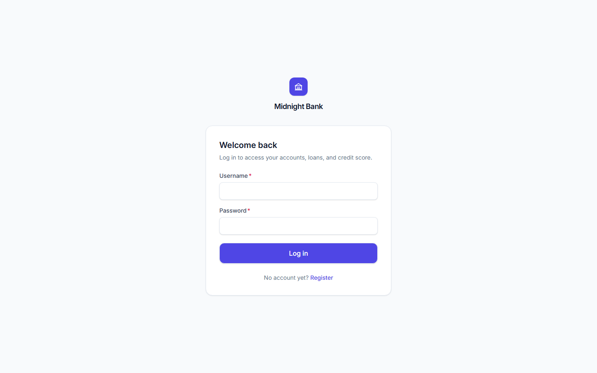
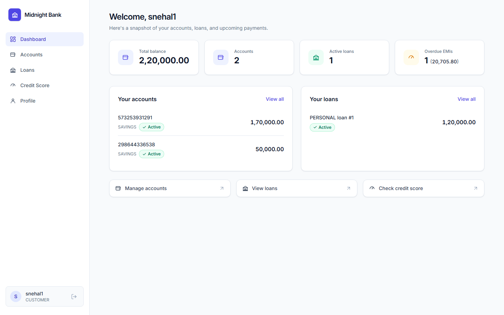
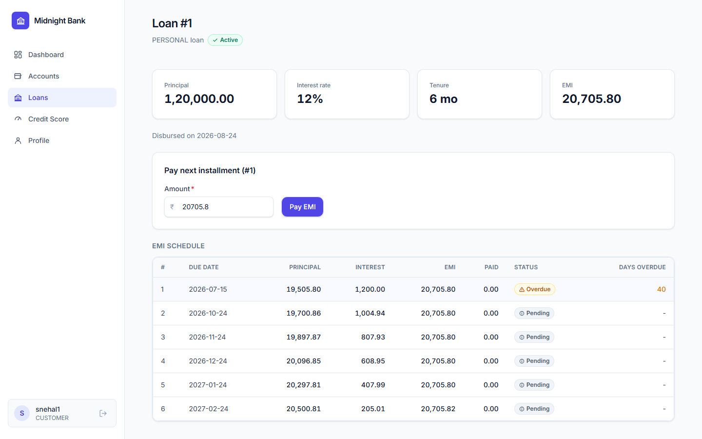
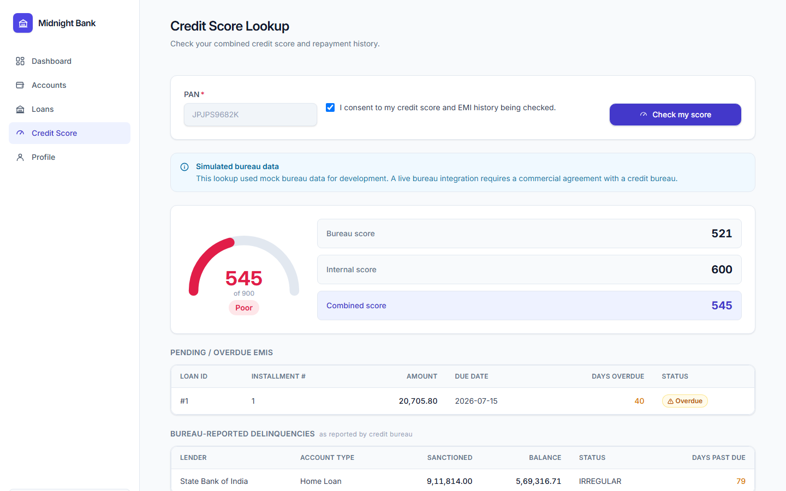

# Midnight Bank

**A full-stack digital banking & credit management platform** — accounts, transactions, loans/EMI tracking, and a PAN-based credit score lookup that surfaces pending/overdue EMIs — built with React, Spring Boot, and MySQL.


> **Before evaluating this for production or real customer data, read [`docs/COMPLIANCE_BOUNDARIES.md`](docs/COMPLIANCE_BOUNDARIES.md).** Credit bureau data is 100% simulated by default, and this codebase does not constitute a banking license, NBFC registration, or formal RBI/DPDP Act compliance certification — see [`docs/EXTERNAL_APIS.md`](docs/EXTERNAL_APIS.md) for exactly what real integrations (CIBIL, Experian, CRIF, Equifax, PAN verification, Aadhaar eKYC) would be needed to go live.

## Screenshots

<table>
<tr>
<td width="50%"></td>
<td width="50%"></td>
</tr>
<tr>
<td width="50%"></td>
<td width="50%"></td>
</tr>
</table>

## Features

- **Auth & KYC** — JWT (access + refresh), BCrypt, role-based access (`CUSTOMER` / `LOAN_OFFICER` / `ADMIN`), KYC profile with PAN encrypted at rest (AES-256-GCM) and masked everywhere except to its owner.
- **Accounts & transactions** — open accounts, deposit/withdraw/transfer with pessimistic-lock concurrency safety (no lost updates under concurrent transfers), paginated transaction history.
- **Loans & EMI** — loan application → approval → disbursement, reducing-balance amortization schedule (principal components sum exactly to the loan amount, no rounding drift), EMI payments, a scheduled job that marks installments overdue → defaulted.
- **Credit score & pending-EMI lookup by PAN** — the core feature: given a PAN, returns a bureau score (mock by default, swappable for a real bureau) combined with an internal score computed from the bank's own repayment history, plus every pending/overdue EMI. Every lookup requires explicit consent and is audited unconditionally — success, not-found, forbidden, or consent-denied.
- **Admin audit trail** — every PAN-based bureau lookup logged and viewable by admins, filterable, never exposing a raw PAN.
- **Modern UI** — Tailwind v4 design system, responsive sidebar shell, accessible components, dark-on-light "neobank" aesthetic.

## Repo layout

See [`docs/ARCHITECTURE.md`](docs/ARCHITECTURE.md) for the full module breakdown.

```
.
├── docker-compose.yml   # MySQL 8, backend, and frontend for a full containerized run
├── docs/                # Architecture, security, compliance, API, and external-API docs
├── backend/              # Spring Boot backend (Maven)
└── frontend/             # Vite + React + TypeScript frontend
```

## Running locally

Two ways to run this: the full containerized stack (one command, closest to how it would actually deploy), or local dev (MySQL in Docker, backend/frontend run natively with hot reload). Both read the same environment variables — copy `.env.example` to `.env` first if you want to override any dev default (neither path strictly requires it; every variable has a dev-safe default).

```bash
cp .env.example .env   # optional for local dev; edit values as needed
```

### Option A — full stack via Docker Compose

```bash
docker-compose up --build
```

This builds and starts three services:

- `db` — MySQL 8 (`bankapp` database), with a healthcheck the backend waits on before starting.
- `backend` — Spring Boot API, built via a multi-stage Maven/JDK 17 → JRE 17 `backend/Dockerfile`, on `http://localhost:8080`. Flyway migrations run automatically on startup.
- `frontend` — the Vite production build served by nginx (`frontend/Dockerfile` + `frontend/nginx.conf`), on `http://localhost:5173`. nginx reverse-proxies `/api/*` to the `backend` service and falls back to `index.html` for client-side routes.

Open `http://localhost:5173` once all three containers are up. Stop everything with `docker-compose down` (add `-v` to also drop the MySQL data volume).

### Option B — local dev (hot reload)

#### 1. Start MySQL

```bash
docker-compose up -d db
```

This starts just the MySQL 8 container (`bankapp` database) on `localhost:3306`. Default dev credentials are in `docker-compose.yml` / `backend/src/main/resources/application-dev.yml` — override via environment variables (or `.env`) for anything beyond local dev.

#### 2. Run the backend

```bash
cd backend
./mvnw spring-boot:run     # or: mvn spring-boot:run
```

The backend runs on `http://localhost:8080` by default, with the `dev` Spring profile active (see `application-dev.yml`). Flyway applies migrations automatically on startup.

Key environment variables (all have dev-only defaults in `application-dev.yml`; production requires them explicitly — see `application-prod.yml`; see `.env.example` for the full list with descriptions):

| Variable | Purpose |
|---|---|
| `DB_HOST`, `DB_PORT`, `DB_NAME`, `DB_USERNAME`, `DB_PASSWORD` | MySQL connection |
| `JWT_SECRET` | JWT signing key (base64, ≥256 bit) |
| `PAN_ENCRYPTION_KEY` | AES-256-GCM key for PAN-at-rest encryption (base64, 256 bit) |
| `PAN_HASH_PEPPER` | HMAC pepper for the deterministic PAN lookup hash |
| `BUREAU_PROVIDER` | `mock` (default) or `real` — see `docs/COMPLIANCE_BOUNDARIES.md` |

#### 3. Run the frontend

```bash
cd frontend
npm install
npm run dev
```

The frontend runs on `http://localhost:5173` by default and expects the backend at `http://localhost:8080/api` (override via `VITE_API_BASE_URL`).

## Running the tests

```bash
cd backend
mvn test      # fast unit tests only (EmiCalculator, InternalScoringService, MaskingUtil, PanAttributeConverter, ...) — no Docker required
mvn verify    # also runs Testcontainers-backed integration tests (*IT.java) against a real MySQL container with real Flyway migrations — requires a running Docker daemon
```

```bash
cd frontend
npx tsc -b && npm run build   # strict type-checks and production-builds the frontend
```

## Documentation

- [`docs/ARCHITECTURE.md`](docs/ARCHITECTURE.md) — module design, repo layout, data model
- [`docs/SECURITY.md`](docs/SECURITY.md) — JWT, PAN encryption/masking, consent, rate limiting, RBAC
- [`docs/COMPLIANCE_BOUNDARIES.md`](docs/COMPLIANCE_BOUNDARIES.md) — **read this first** — what's real vs. simulated/mocked, and what this codebase does not certify
- [`docs/API.md`](docs/API.md) — endpoint reference
- [`docs/EXTERNAL_APIS.md`](docs/EXTERNAL_APIS.md) — the real external APIs (credit bureaus, PAN verification, Aadhaar eKYC, Account Aggregator) needed to go live, and how to get access to each

## Author

Built and maintained by [**snehalsuk**](https://github.com/snehalsuk).

## License

Licensed under the [MIT License](LICENSE).
